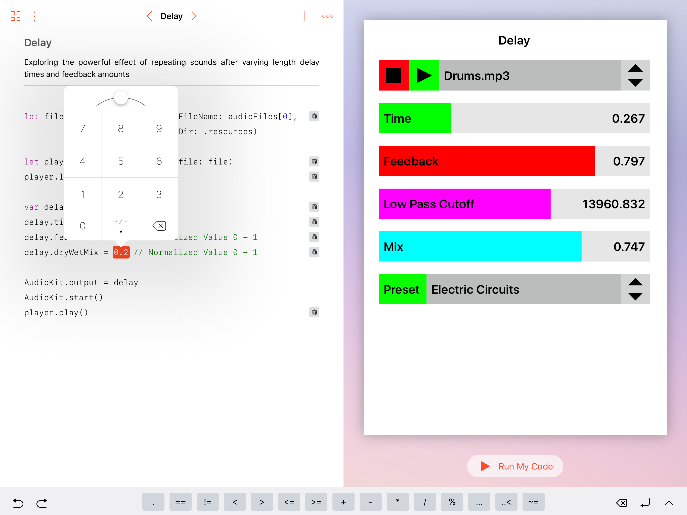

# The AudioKit Playground Book

This is now the easiest way to try out AudioKit playgrounds.  Just put "AudioKit.playgroundbook" in your Playgrounds folder on iCloud Drive, or use AirDrop to transfer it onto your iPad, which will prompt you to open the playground book in the Playgrounds app.

There are some limitations.  It requires iOS10.   It is not a complete copy of AudioKit's functionality and only contains a fraction of the playgrounds available from within Xcode.  There are no synthesis or analysis playgrounds and you cannot currently access the microphone from iPad Playgrounds.

But, its a great start and good introduction to what kind of things are possible with AudioKit!

